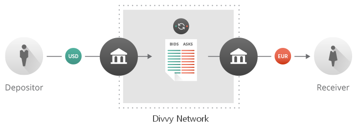

# Sharing the Global Economy

**What is Divvy?**

Divvy is the open-source, distributed payment protocol that enables instant
payments with low fees, no chargebacks, and currency flexibility (for example
dollars, yen, euros, bitcoins, or even loyalty points). It is the worlds fastest and most secure payment system.  Businesses of any size
can easily build payment solutions such as banking or remittance apps, and
accelerate the movement of money. Divvy enables the world to move value the
way it moves information on the Internet.

**What is a Gateway?**

Divvy works with gateways: independent businesses which hold customer
deposits in various currencies such as U.S. dollars (USD) or Euros (EUR),
in exchange for providing cryptographically-signed issuances that users can
send and trade with one another in seconds on the Divvy network. Within the
protocol, exchanges between multiple currencies can occur atomically without
any central authority to monitor them. Later, customers can withdraw their
Divvy balances from the gateways that created those issuances.

**How do Divvy payments work?**

A sender specifies the amount and currency the recipient should receive and
Divvy automatically converts the sender’s available currencies using the
distributed order books integrated into the Divvy protocol. Independent third
parties acting as  market makers provide liquidity in these order books.

Divvy uses a pathfinding algorithm that considers currency pairs when
converting from the source to the destination currency. This algorithm searches
for a series of currency swaps that gives the user the lowest cost. Since
anyone can participate as a market maker, market forces drive fees to the
lowest practical level.

**What can you do with Divvy?**

The protocol is entirely open-source and the network’s shared ledger is public
information, so no central authority prevents anyone from participating. Anyone
can become a market maker, create a wallet or a gateway, or monitor network
behavior. Competition drives down spreads and fees, making the network useful
to everyone.

### Key Protocol Features
1. XDV is Divvy’s native [cryptocurrency]
(http://en.wikipedia.org/wiki/Cryptocurrency) with a fixed supply that
decreases slowly over time, with no mining. XDV acts as a bridge currency, and
pays for transaction fees that protect the network against spam.

2. Pathfinding discovers cheap and efficient payment paths through multiple
[order books](https://www.divvycharts.com) allowing anyone to [trade](https://www.divvytrade.com) anything. When two accounts aren’t linked by relationships of trust, the Divvy pathfinding engine considers intermediate links and order books to produce a set of possible paths the transaction can take. When the payment is processed, the liquidity along these paths is iteratively consumed in best-first order.

3. [Consensus](https://www.youtube.com/watch?v=pj1QVb1vlC0) confirms
transactions in an atomic fashion, without mining, ensuring efficient use of
resources.

[transact]: https://xdv.io/files/divvy-FIs.pdf
[build]:    https://xdv.io/build/

[transact.png]:   /images/transact.png
[build.png]:      /images/build.png
[contribute.png]: /images/contribute.png

### Join The Divvy Community
|![Transact][transact.png]|![Build][build.png]|![Contribute][contribute.png]|
|:-----------------------:|:-----------------:|:---------------------------:|
|[Transact on the fastest payment infrastructure][transact]|[Build Imaginative Apps][build]|Contribute to the Divvy Protocol Implementation|

# divvyd - Divvy P2P server

## 

This is the repository for Divvy's `divvyd`, reference P2P server.

### Build instructions:
* https://xdv.io/wiki/Divvyd_build_instructions

### Setup instructions:
* https://xdv.io/wiki/Divvyd_setup_instructions

### Issues
* https://divvylabs.atlassian.net/browse/RIPD

### Repository Contents

#### ./bin
Scripts and data files for Divvy integrators.

#### ./build
Intermediate and final build outputs.

#### ./Builds
Platform or IDE-specific project files.

#### ./doc
Documentation and example configuration files.

#### ./src
Source code directory. Some of the directories contained here are
external repositories inlined via git-subtree, see the corresponding
README for more details.

#### ./test
Javascript / Mocha tests.

## License
Divvy is open source and permissively licensed under the ISC license. See the
LICENSE file for more details.

### For more information:
* Divvy Wiki - https://xdv.io/wiki/
* Divvy Primer - https://xdv.io/divvy_primer.pdf
* Divvy Primer (Market Making) - https://xdv.io/divvy-mm.pdf
* Divvy Gateway Primer - https://xdv.io/divvy-gateways.pdf  
* Consensus - https://wiki.xdv.io/Consensus

